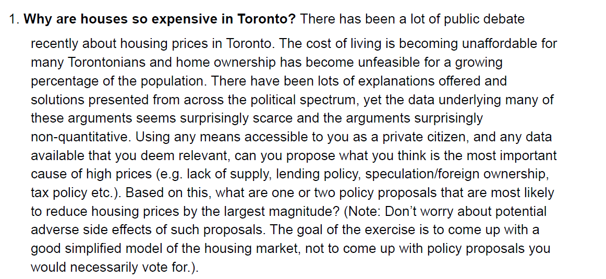

# Toronto Housing Prices Statistical Analysis

This repository hosts a [statistical analysis](https://github.com/arashshams/Toronto_Housing_Prices/blob/master/Analysis.ipynb) to answer the following open-ended question.



### Dependencies

If you want to reproduce the [report](https://github.com/arashshams/Toronto_Housing_Prices/blob/master/Analysis.ipynb) (`Analysis.ipynb`) on your local, simply run below commands in terminal to create the environment for running the notebook.

```
conda env create -f environment.yaml
conda activate env
```
